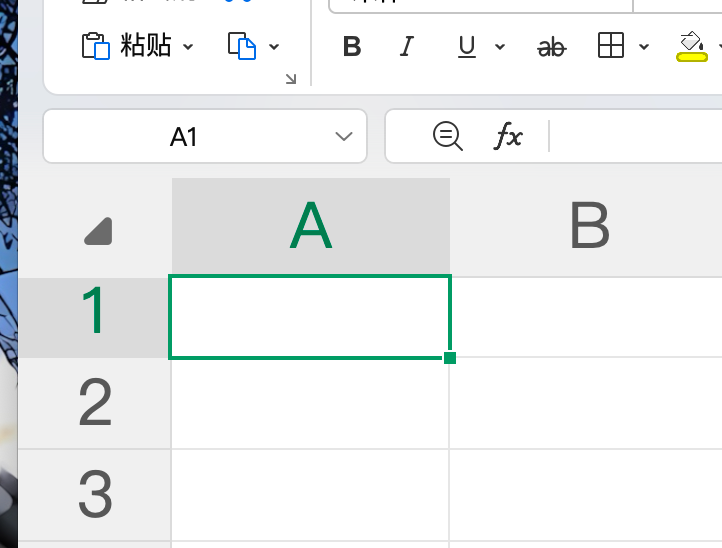
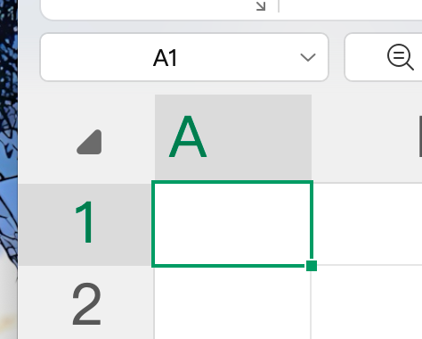
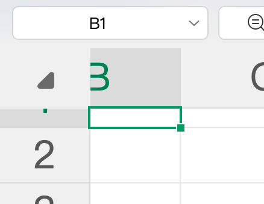
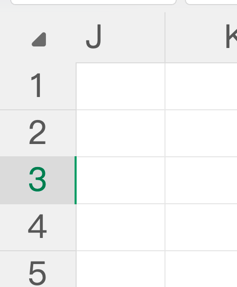

# 支持功能

1. 支持行选择 / 列选择 - 支持开启选择框、支持设置单选多选，默认多选
2. 支持行拖拽排序 / 列拖拽排序 - 支持设置拖拽手柄或整行拖拽
3. 支持行固定 / 列固定 - 要有阴影 inset -10px 0 8px -8px **var**(rgba(5,5,5,0.06))
4. 列序号 - 支持自定义样式
5. 支持列排序
6. 支持列搜索
7. 支持列宽度拖拽
8. 支持固定表头
9. 支持负责表头
10. 支持单元格编辑 - 输入框、数字框、下拉框、日期选择框
11. 支持自定义单元格
12. 支持单元格编辑，聚焦要有2px的聚焦样式 - 聚焦样式看下面各情况介绍
13. 单击聚焦，双击编辑
14. 新增行标记浅绿背景，编辑的单元格标记浅橘色背景
15. 支持合并单元格
16. 支持选中区域右键菜单复制数据
17. 支持开启虚拟滚动
18. 支持主题设置，样式自定义

# 单元格聚焦样式

默认聚焦样式。是2px的外边框。要考虑固定列和表头的情况

有偏移的样式，这时候左边是固定列，那么聚焦的左边框应该是在固定列上

上下都有偏移的样式，左边框和上边框分别在左固定列和表头上

完全偏移后的样式  在固定列上还是会有一条线的标记

如果向左上偏移并且完全看不到了。那么左上应该有一个2*2的点。表示聚焦在左上。这个没有示例，你要理解我的意思

在表格滚动的时候要做好交互效果

# 要做的优化

1. 要是受控组件
2. 数据超时，渲染错误 这些错误边界要做好
3. 一定要做到轻量级，高性能，交互顺畅，非常重要

# 注意

要做好组件封装，代码拆分，注释也要写到详细
